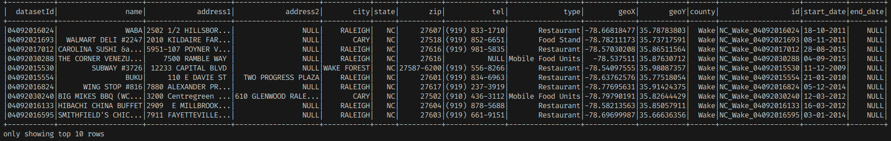
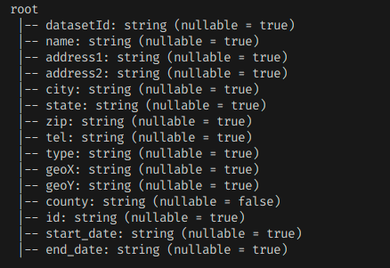
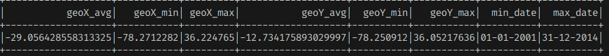

# Zig-flow: A Pipeline for datasets processing and for analytics.  
#### This project is the prototype of my FYP.


## How it Works
1. **Data Ingestion**: Datasets are ingested from multiple data sources. Since this is at an early stage I choose to go with file system.
2. **Processing of data sets using apache-spark**: Datasets are processed currently running this on single node machine.
3. **Export data to MYSQL**: Once data is processed it is exported to MYSQL database.


## Requirements
- Apache Spark 3.1.2
- Java 17
- Scala 2.12

## Example Usage
1. If you do not wish to export processed data to MYSQL or any database of your choice.

#### Run this
```bash
# This wil first create the jar file and then run a spark job.
./scripts/build_and_run.sh

# If you already have created the jar file via mvn package run this.
./scripts/run.sh
```
2. If you wish to export data to a database.
#### Run this
```bash
# Run this script to dump the schema changes to MYSQL database (make sure your database credentials are correct open this script for more).
./scripts/create_schema.sh

# This wil first create the jar file and then run a spark job.
./scripts/build_and_run.sh

# If jar file is already created run this script.
./scripts/run-and-export-data/run.sh
```

#### After sometime when spark have finished performing it's processing it'll print the result such as schema of dataset and summary to standard output.

## Example output
### Dataset output



### Schema output


### Summary output

